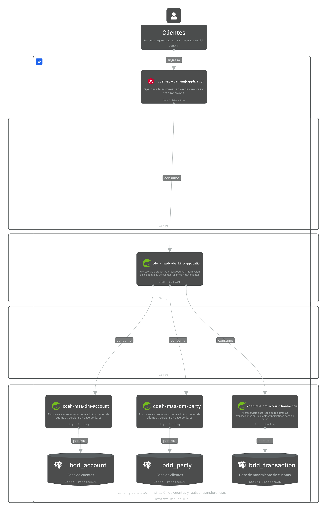

# Banking Application - Microservicio Orquestador

## Descripción
Este microservicio actúa como orquestador para coordinar las operaciones entre los tres microservicios de dominio:
- **Party Service** (puerto 8080): Gestión de clientes
- **Account Service** (puerto 8081): Gestión de cuentas
- **Transaction Service** (puerto 8082): Gestión de transacciones

Se ejecuta en el puerto **8083** y expone APIs REST para que el frontend pueda consumir todas las funcionalidades de manera centralizada.

## Arquitectura
Para más detalles sobre la arquitectura, puedes consultar: [Arquitectura del Sistema](https://s.icepanel.io/K5d5PzFi75vnuy/oIyI)




## Endpoints Disponibles

### Clientes (Customers)
- `POST /api/v1/customers` - Crear cliente
- `GET /api/v1/customers` - Obtener todos los clientes
- `GET /api/v1/customers/{customerId}` - Obtener cliente por ID
- `PUT /api/v1/customers/{customerId}` - Actualizar cliente
- `DELETE /api/v1/customers/{customerId}` - Eliminar cliente

### Cuentas (Accounts)
- `POST /api/v1/accounts` - Crear cuenta
- `GET /api/v1/accounts` - Obtener todas las cuentas
- `GET /api/v1/accounts/{accountId}` - Obtener cuenta por ID
- `GET /api/v1/accounts/number/{accountNumber}` - Obtener cuenta por número
- `GET /api/v1/accounts/customer/{customerId}` - Obtener cuentas de un cliente
- `PUT /api/v1/accounts/{accountId}` - Actualizar cuenta
- `PATCH /api/v1/accounts/{accountId}/balance` - Actualizar balance
- `DELETE /api/v1/accounts/{accountId}` - Eliminar cuenta

### Transacciones (Transactions)
- `POST /api/v1/transactions` - Crear transacción
- `GET /api/v1/transactions` - Obtener todas las transacciones activas
- `GET /api/v1/transactions/{transactionId}` - Obtener transacción por ID
- `GET /api/v1/transactions/customer/{customerId}/account/{accountNumber}?startDate=&endDate=` - Obtener transacciones por cliente y cuenta
- `PUT /api/v1/transactions/{transactionId}` - Actualizar transacción
- `DELETE /api/v1/transactions/{transactionId}` - Eliminar transacción

## Configuración
El microservicio está configurado para conectarse a los siguientes servicios:
```yaml
application:
  url:
    party-service: http://localhost:8080 
    account-service: http://localhost:8081
    transaction-service: http://localhost:8082
```
Urls de los microservicios asociados:
- [Party Service](https://github.com/christopherdavideh/cdeh-msa-dm-prdd-party)
- [Account Service](https://github.com/christopherdavideh/cdeh-msa-dm-account)
- [Transaction Service](https://github.com/christopherdavideh/cdeh-msa-dm-account-transaction)

## Estructura del Proyecto
```
src/main/java/com/banking/cdeh_msa_bp_banking_application/
├── configuration/          # Configuración de la aplicación
├── controller/             # Controladores REST
├── repository/             # Interfaces de repositorio
│   └── impl/              # Implementaciones de repositorio
├── service/               # Interfaces de servicio
│   ├── dto/              # DTOs para transferencia de datos
│   └── impl/             # Implementaciones de servicio
└── CdehMsaBpBankingApplication.java
```

## Características Técnicas
- **Framework**: Spring Boot 3.x con WebFlux
- **Programación Reactiva**: Uso de Mono y Flux
- **Cliente HTTP**: WebClient para comunicación entre microservicios
- **Logging**: SLF4J para trazabilidad completa
- **Validación**: Bean Validation para validación de entrada
- **Manejo de Errores**: Manejo robusto de errores con logging detallado

## Ejemplos de Uso

### 1. Crear Cliente
```bash
curl -X POST http://localhost:8083/api/v1/customers \
  -H "Content-Type: application/json" \
  -d '{
    "party": {
      "name": "Jose Lema",
      "gender": "M",
      "age": 18,
      "identification": "1722249549",
      "address": "Otavalo sn y principal",
      "phone": "098254785"
    },
    "customer": {
      "password": "1234"
    }
  }'
```

### 2. Crear Cuenta
```bash
curl -X POST http://localhost:8083/api/v1/accounts \
  -H "Content-Type: application/json" \
  -d '{
    "accountType": "CORRIENTE",
    "customerId": "f016fe94-0ed5-4bda-b5a6-4bb55a74f336"
  }'
```

### 3. Crear Transacción
```bash
curl -X POST http://localhost:8083/api/v1/transactions \
  -H "Content-Type: application/json" \
  -d '{
    "customerId": "f016fe94-0ed5-4bda-b5a6-4bb55a74f336",
    "sourceAccount": "4787580001",
    "initialBalance": 1000.00,
    "amount": -150.00,
    "availableBalance": 850.00
  }'
```
